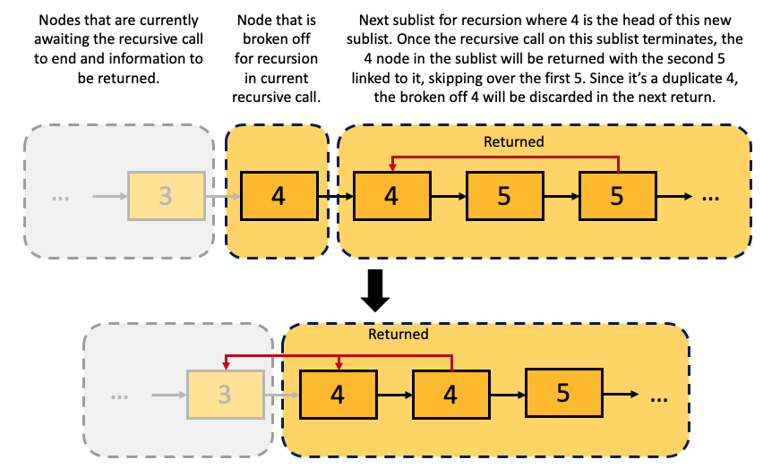

## The Node Class
```java
public class SinglyLinkedList <T> {
  // reference to another node object
  private static class Node <T> { 
    private T data;
    
    // in some implementations, the Node class may not be an inner class and just be a separate auxiliary one
    private Node <T> next;
    private Node <T> head;
    
    private Node(T data, Node <T> next){
      this.data = data;
      this.next = next;
    }
    
    // constructor chaining; adds flexibility in creating instances of Node
    private Node(T data) {
      // null is set to default
      this(data, null);
    }
    
    private void addToFront(T data){
      Node<T> newNode = new Node<> (data);
      // assign newNode's next element to the current head (pointer)
      newNode.next = head;
      
      // assign the pointer head to the new Node
      head = newNode;
    }
    
    public void addToBack(T data) {
      if (head == null){
        // if List is empty, instantiate a new Node
        // The reason this is an edge case is because the while loop 
        // condition checks current.next before checking if current 
        // itself is null. If current were null (the list is empty), 
        // then current.next would throw a NullPointerException, 
        // causing the code to crash.
        head = new Node<>(data);
      } else {
        Node <T> current = head;
        
        // go to the last node
        while (current.next != null) {
          current = current.next;
        }
        current.next = new Node<>(data);
    }
      
    public void removeFromFront() {
      head = head.next;
      // no need to explicitly remove the previous Node as Java implements
      // GC, which frees up the memory that's no longer accesibile
    }
      
    public void removeFromBack() {
      if (head == null) {
        // if empty
        return ;
      } else if (head.next == null) {
        // if only one node
        head = null;
      } else {
        Node current = head;
        
        // access the node before the last
        while(current.next.next != null) {
          current = current.next;
        }
        current.next = null;
      }
    }
    
    /*
    Optimization with tail reference
    -  adding a tail pointer to point to the last node in the list
    -  adding to the back becomes O(1) time
    - does not solve the problem of removing from the back
    - adds edge cases for transitioning between size 0 and 1 lists due to the head and tail being interrelated in these cases (either pointing to null or pointing to the same node)
    */   
   
    public String toString(data) {
      String answer = "";
      Node <T> current = head;
      while(current!=null){
        answer += current + " ";
        current = current.next;
      }
      
      return answer;
    }
    
  }
}
```

## Iterable in LinkedLists
```java
import java.util.Iterator

public class LinkedList<T> implements Iterable<T> {
  // same as previous
  public Iterator<T> iterator() {
    return new LLIterator<>();
  }
  
  private class LLIterator implements Iterator<T> {
    private Node<T> curr;
    LLIterator() { current = head; }
    public boolean hasNext() { return curr!=null;}
    public T next() {
      if (hasNext()) {
        T temp = curr.data;
        curr = curr.next;
        return temp;
       }
       return null;
    }
  }
}
```

```
LinkedList<String> courses = new LinkedList<>();
// populate list

Iterator<String> courseIterator = courses.iterator();
while(courseIterator.hasNext()) {
  String data = courseIterator.next();
  // do anything you want with the data here
}
```

## Recursion in LinkedLists

Problem: Given internal access to a SLL with comparable data, where all of the data is guaranteed to be in sorted order, remove all duplicates from the list so that there is at most one of each data. This task should be done in O(n) time and O(1) space.

Note: this is a step-wise reduction of the original linked list



```java
// assuming a sorted linkedlist
  public void removeDuplicates() {
    head = rRemove(head);
  }
  
  private Node<T> rRemove(Node<T> curr){
    // terminating condition when pointer reaches the end of the LL
    if (curr == null){
      return null;
    }
    
    curr.next = rRemove(curr.next);
    
    // if not the end and is duplicate
    // use compareTo rather than equals since it's a Comparable implementation
    if (curr.next != null && curr.data.compareTo(curr.next.data) {
      return curr.next;
    }
    
    return curr;
  }
```
